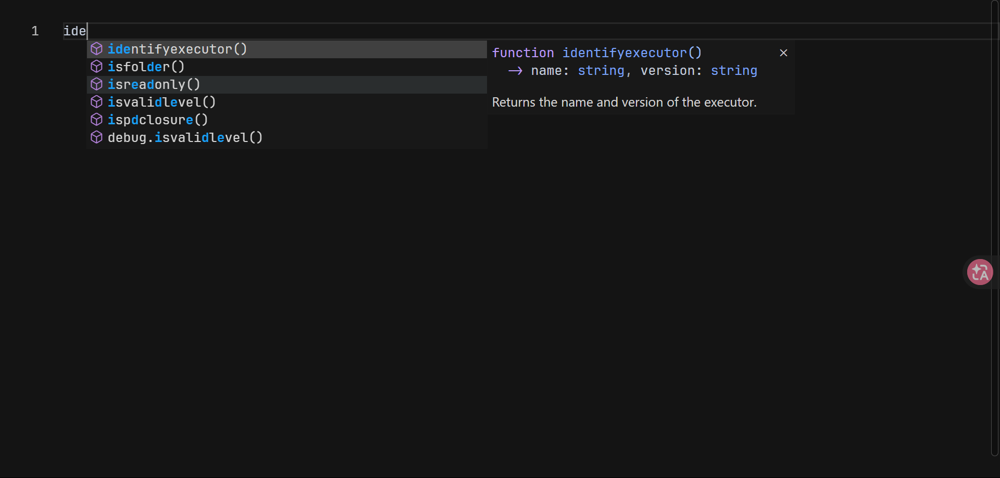
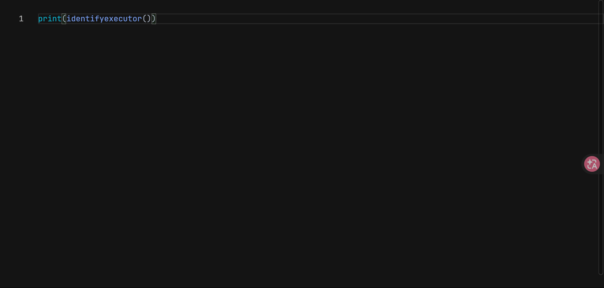
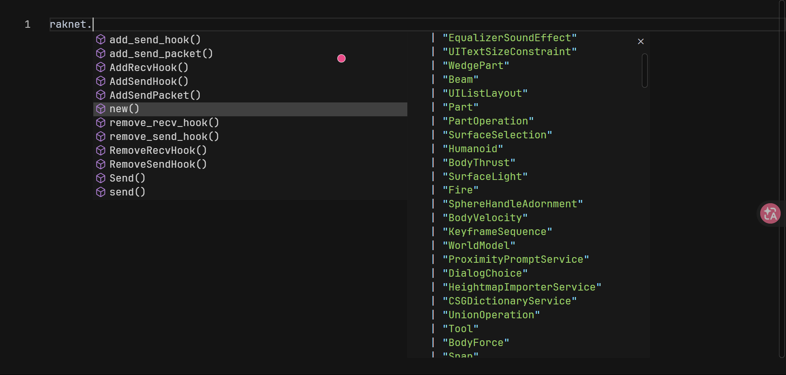
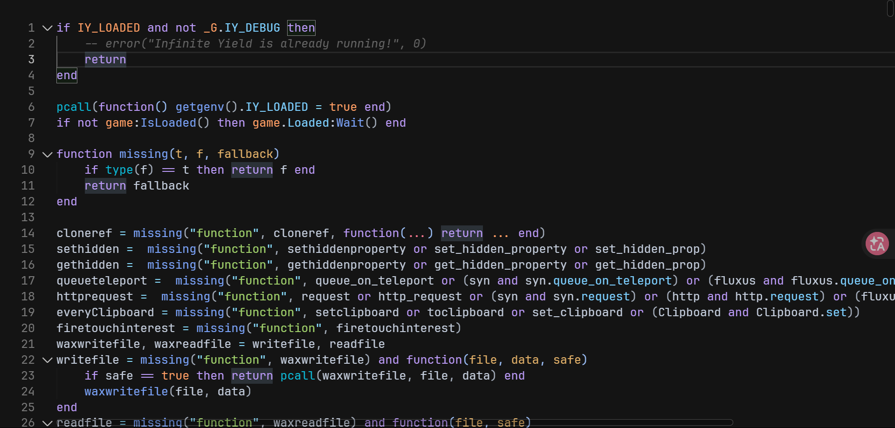

  
  <h1 align="center">Spash Monaco</h1>
  

      A highly customizable monaco editor made for Luau scripting.
       
      by <a href="https://socl.gg/input">@Kamerzystanasyt</a>
  

 

  
  
   
  
   
  

 

## Preview

  
  

  
  

---

## Reference

| Function / Global API | Arguments | Description |
| :--- | :--- | :--- |
| `GetText()` | None | Returns the full current text content from the editor as a string. |
| `SetText(x)` | `x` (String / JSON string) | Sets the text of the editor. Attempts to parse JSON strings natively or falls back to literal string format. |
| `SetTheme(themeName)` / `SwitchTheme(themeName)` | `themeName` (String: `'PDark'`, `'Dark'`, `'Light'`, `'isaeva'`) | Switches the current editor theme. Map values target explicit predefined rule templates. |
| `SwitchMinimap(flag)` | `flag` (Boolean) | Toggles the visibility/rendering of the editor minimap. |
| `SwitchReadonly(flag)` | `flag` (Boolean) | Toggles whether the editor instance layout is read-only. |
| `SwitchRenderWhitespace(op)` | `op` (String: `'none'`, `'boundary'`, `'all'`) | Sets the policy for displaying whitespace characters. |
| `SwitchLinks(flag)` | `flag` (Boolean) | Configures whether clickable links are active inside the editor. |
| `SwitchLineHeight(num)` | `num` (Number) | Adjusts the spacing height allocation per text entry line. |
| `SwitchFontSize(num)` | `num` (Number) | Scales the font rendering pixels size configuration. |
| `SwitchFolding(flag)` | `flag` (Boolean) | Toggles code-block folding collapse options features. |
| `SwitchAutoIndent(flag)` | `flag` (Boolean) | Sets whether lines automatically indent according to language scope. |
| `SwitchFontFamily(name)` | `name` (String) | Changes the font family fallback chain applied to editor layout text. |
| `SwitchFontLigatures(flag)` | `flag` (Boolean) | Toggles advanced stylistic font rendering ligatures options. |
| `SetScroll(line)` | `line` (Number) | Centers view pane rendering focus specifically to the chosen line index number. |
| `Refresh()` | None | Forces layout evaluation update pipeline by clearing then re-simulating keystroke buffer value sets. |
| `GetProposals()` | None | Returns the raw internal configuration table array stack handling stored text completion models. |
| `AddRawSnippet(data)` | `data` (Object) | Directly inserts a raw formatted suggestion profile model into autocomplete arrays. |
| `AddSnippet(kindName, snippetName, data)` | `kindName` (String), `snippetName` (String), `data` (Object) | Generates and logs customizable structural auto-completion structures onto standard suggestion handlers. |
| `ShowErr(line, column, endline, endcolumn, errMessage)` | `line`, `column`, `endline`, `endcolumn` (Numbers), `errMessage` (String) | Creates inline squiggly red visual text highlights and maps an error string over target coordinates. |
| `updateBackground(...)` | `url`, `opacity`, `textOpacity`, `fillMode`, `textBrightness`, `zoom`, `rotation`, `minimapTransparent` | Configures host backdrop workspace. Accepts data/remote streams for images or HTML5 `.mp4`/`.webm` looped videos. |
| `OnDidChangeContent(callback)` | `callback` (Function) | Event connection. Triggers specified function tracking structural string context adjustments. |
| `OnDidChangeCursorPosition(callback)` | `callback` (Function) | Event connection. Sends accurate model positions tracking context pointer updates back out to listener frames. |
| `Cut()` | None | Triggers target text line execution buffer focus pipeline mapping systemic clipboard cut events. |
| `Copy()` | None | Triggers target text line execution buffer focus pipeline mapping systemic clipboard copy events. |
| `Paste()` | None | Triggers target text line execution buffer focus pipeline mapping systemic clipboard paste events. |
| `Undo()` | None | Tracks structural historical transaction stacks backwards to rollback textual iterations. |
| `Redo()` | None | Pushes forward along structural transaction modification history stacks. |
| `Delete()` | None | Erases active selections inside current execution layouts. |
| `SelectAll()` | None | Generates sweeping absolute string captures enveloping structural content blocks instantly. |

---

## Returns

The editor instance emits specific status alerts up to the host container using `window.chrome.webview.postMessage`. Remember to capture these inside your application wrapper:

* **`"Monaco Ready"`**: Runs immediately after an successful monaco load.
* **`"keydown"`**: Communicated sequentially intercepting global input actions interacting live over text layout views. (for lsp)
* **`"js err: [msg] at [url]:[line]"`**: Global error catch logic for future monaco errors.

